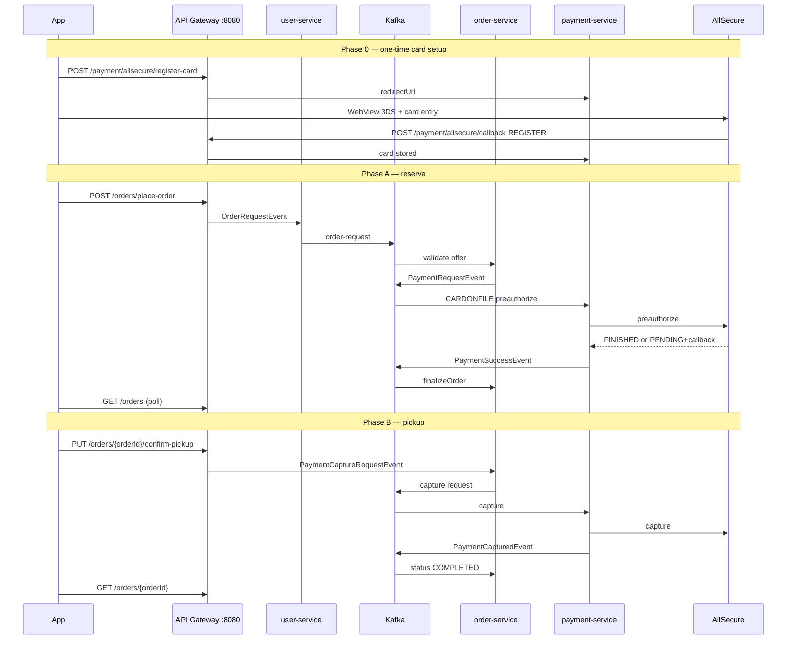

# Android AI Agent Prompt: AllSecure Order Lifecycle (Reserve → Pickup → Cancel)

## Your role

You are an AI agent implementing the **customer-facing Android app** for StillFresh against the **current backend** (June 2026). The backend uses **AllSecure** for Serbian domestic card payments in a **Too Good To Go–style** flow:

- **Reserve (place order):** preauthorize funds on the customer's stored card — order becomes `CONFIRMED`, stock decreases.
- **Pickup:** capture the hold when the customer collects the bag — order becomes `COMPLETED`.
- **Cancel / expire:** void the hold and restore stock.

This guide supersedes Stripe-specific assumptions in older mobile prompts when `PAYMENT_PROVIDER=allsecure` is active on the backend.

**Backend references (read if unsure):**

- `.cursor/skills/order-lifecycle-allsecure/SKILL.md` — protocol definitions
- `ORDER_LIFECYCLE_ALLSECURE_SUMMARY.md` — event pipeline & DB mapping
- `ALLSECURE_LOCAL_DEV.md` — ngrok / sandbox setup (dev only)

---

## Base configuration

| Setting | Value |
|---------|--------|
| Base URL (dev) | `http://localhost:8080` (API Gateway only — never call `:8081`–`:8086` directly) |
| Auth | `Authorization: Bearer <access_token>` on every protected call |
| Content-Type | `application/json` |
| Currency | Offer-driven (typically `RSD`); amounts in API responses are **major units** (e.g. `365.0` RSD) |

Token refresh: follow `ANDROID_JWT_TOKEN_REFRESH_IMPLEMENTATION_PROMPT.md` if present in the repo.

---

## Terminology (critical)

| User-facing term | DB `status` | Payment state |
|------------------|-------------|---------------|
| Reserved / active order | `CONFIRMED` | AllSecure preauth hold active |
| Picked up | `COMPLETED` | Capture succeeded |
| Cancelled | `CANCELLED` | Void succeeded |
| Missed pickup window | `EXPIRED` | Void succeeded |

**`paymentIntentId` on orders is NOT always `pi_…`.** With AllSecure it is the **preauthorization reference UUID** (e.g. `b8f1a77954e4409a619f`). Do not gate pickup on Stripe prefixes.

**`offerId` ≠ `orderId`.** After place-order, poll `GET /orders` — do not call `GET /orders/{offerId}`.

---

## Architecture overview



---

## Phase 0 — Card on file (prerequisite)

Every card order **requires** a default stored card before `place-order`.

### Register card

```http
POST /payment/allsecure/register-card
Authorization: Bearer <access_token>
Content-Type: application/json

{}
```

**200 OK:**

```json
{
  "provider": "allsecure",
  "redirectUrl": "https://asxgw.paymentsandbox.cloud/redirect/...",
  "transactionId": "reg-...",
  "message": "Open the redirect URL to enter your card details."
}
```

**Android implementation:**

1. Open `redirectUrl` in **Chrome Custom Tabs** or **WebView** (enable JavaScript).
2. User enters card on AllSecure hosted page and completes **3DS**.
3. AllSecure redirects browser to `{PUBLIC_URL}/payment/allsecure/return?status=success` (informational only).
4. Card persistence happens via **server-to-server callback** — poll payment methods (step 5).

**Sandbox test cards:**

| Card | Result |
|------|--------|
| `4111 1111 1111 1111` | Success (Visa) — use for registration |
| `5555 5555 5555 4444` | Success (Mastercard) |
| `4200 0000 0000 0000` | Declined (`errorCode` 2003) — do **not** use |

On 3DS simulator: **Authenticated (ECI 05)** → Submit.

### List payment methods

```http
GET /payment/allsecure/payment-methods
Authorization: Bearer <access_token>
```

**200 OK** — array of:

```json
{
  "paymentMethodId": "a4e927d398914c896e22",
  "type": "card",
  "isDefault": true,
  "cardBrand": "visa",
  "cardLast4": "1111",
  "cardExpMonth": 2,
  "cardExpYear": 2027
}
```

**Gate place-order UI:** require `isDefault == true` (or at least one card). Show last4 + brand.

### Delete card

```http
DELETE /payment/allsecure/payment-methods/{paymentMethodId}
Authorization: Bearer <access_token>
```

---

## Phase A — Reserve (place order)

### Endpoint

```http
POST /orders/place-order
Authorization: Bearer <access_token>
Content-Type: application/json

{
  "offerId": 33,
  "quantity": 2,
  "requestId": "ecf3e529-776f-4bd8-8088-cb5e65a86a05"
}
```

**Do not send** `userId` / `username` — backend sets them from JWT.

**`requestId` (recommended):** client-generated UUID used to poll payment status. If omitted, the server generates one and returns it in the response.

**Optional:** `paymentMethod` — omit or `"STRIPE_CARD"` for card flow; `"BANK_TRANSFER"` only if bank-transfer UI exists.

**200 OK:**

```json
{
  "message": "Order request submitted successfully.",
  "requestId": "ecf3e529-776f-4bd8-8088-cb5e65a86a05"
}
```

This only means the **async pipeline started**. It does **not** mean an order row exists yet. Use `requestId` for payment-status polling (below).

### What happens server-side (async)

1. `order-service` validates offer (active, stock, not expired).
2. `payment-service` runs AllSecure **CARDONFILE preauthorize** using the JWT **username** (must match the username used at card registration).
3. On success → `PaymentSuccessEvent` → order inserted with `status=CONFIRMED`, stock decremented, push notification sent.

Typical latency: **2–15 seconds** without 3DS; with step-up 3DS add ~10–30s for user approval in WebView.

### Poll payment status (required)

```http
GET /payment/allsecure/payment-status/{requestId}
Authorization: Bearer <access_token>
```

**200 OK — processing (offer validation or preauth in flight):**

```json
{
  "requestId": "ecf3e529-776f-4bd8-8088-cb5e65a86a05",
  "status": "PROCESSING",
  "message": "Payment is being processed."
}
```

**200 OK — 3DS required (open WebView immediately):**

```json
{
  "requestId": "ecf3e529-776f-4bd8-8088-cb5e65a86a05",
  "status": "AUTHENTICATION_REQUIRED",
  "redirectUrl": "https://asxgw.paymentsandbox.cloud/redirect/...",
  "offerId": 33,
  "paymentIntentId": "5f82e14f096ac2bef4e9",
  "message": "Complete payment authentication to confirm your order."
}
```

**200 OK — authorized (order should appear on GET /orders):**

```json
{
  "requestId": "ecf3e529-776f-4bd8-8088-cb5e65a86a05",
  "status": "AUTHORIZED",
  "offerId": 33,
  "paymentIntentId": "5f82e14f096ac2bef4e9",
  "message": "Payment authorized. Your order should be confirmed shortly."
}
```

**200 OK — failed:**

```json
{
  "requestId": "ecf3e529-776f-4bd8-8088-cb5e65a86a05",
  "status": "FAILED",
  "failureReason": "The transaction was declined",
  "message": "The transaction was declined"
}
```

| `status` | App action |
|----------|------------|
| `PROCESSING` | Poll again in 1–2s |
| `AUTHENTICATION_REQUIRED` | Open `redirectUrl` in Custom Tab / WebView; continue polling after user returns |
| `AUTHORIZED` | Poll `GET /orders` until `CONFIRMED` row appears, then navigate to order detail |
| `FAILED` | Show error; do not open register-card unless card missing |

### Android: post-place-order UX (required)

```kotlin
suspend fun placeOrderAndWait(offerId: Long, quantity: Int): OrderDto {
    val requestId = UUID.randomUUID().toString()
    val placeResponse = api.placeOrder(PlaceOrderRequest(offerId, quantity, requestId))
    val correlationId = placeResponse.requestId

    var authWebViewShown = false
    repeat(60) { // ~90s total
        when (val payment = api.getPaymentStatus(correlationId).status) {
            "FAILED" -> throw PaymentFailedException(payment.failureReason)
            "AUTHENTICATION_REQUIRED" -> {
                if (!authWebViewShown) {
                    openPaymentWebView(payment.redirectUrl) // same component as register-card
                    authWebViewShown = true
                }
            }
            "AUTHORIZED" -> {
                return pollOrdersUntilConfirmed(offerId)
            }
        }
        delay(1_500)
    }
    throw PaymentTimeoutException("Payment was not confirmed in time.")
}
```

**On `AUTHORIZED`:** navigate to order detail (`CONFIRMED`), show pickup window (`pickupBy`).

**On `FAILED`:** show `failureReason`; do not call `register-card` unless the reason is “No registered card”.

### 3DS at order time

Sandbox often requires **a second 3DS step** on CARDONFILE preauth even after card registration. The backend now exposes `redirectUrl` via payment-status polling — **reuse the same WebView** as register-card. User interaction is required (~few seconds); it cannot run fully in the background when `AUTHENTICATION_REQUIRED` is returned.

---

## Phase B — Pickup (capture)

When the customer collects the bag at the vendor, trigger capture.

```http
PUT /orders/{orderId}/confirm-pickup
Authorization: Bearer <access_token>
```

No request body.

**200 OK:**

```json
{
  "success": true,
  "message": "Pickup confirmed. Payment capture has been requested."
}
```

Capture is **async**. Poll order until `status == "COMPLETED"` (same pattern as place-order, ~30s timeout).

**Error codes (body `message`):**

| HTTP | Meaning |
|------|---------|
| 400 `INVALID_STATUS` | Order not in `CONFIRMED` / `PROCESSING` / `READY` |
| 400 `NO_PAYMENT_REFERENCE` | No `paymentIntentId` on order |
| 403 / 404 | Not owner or not found |

**Android UI:** “Preuzeto” / “Picked up” button on active order detail; show loading until `COMPLETED`.

---

## Phase C — Cancel + geo-fence (anti-bypass)

```http
PUT /orders/{orderId}/cancel
Authorization: Bearer <access_token>
Content-Type: application/json

{
  "reason": "Changed my mind",
  "userLat": 44.8125,
  "userLon": 20.4612
}
```

| Field | Required | Purpose |
|-------|----------|---------|
| `reason` | No | Shown in history |
| `userLat` | **Strongly recommended** | Fraud engine input |
| `userLon` | **Strongly recommended** | Fraud engine input |

**Always request location permission** before cancel when possible. Backend **does not block** cancel if coords are missing — it only skips fraud scoring.

**Fraud rule (backend):** if customer cancels while **&lt; 50 m** from the vendor (order snapshot lat/lon) **and** inside the pickup window → `FraudFlagEvent` → increments `bypass_strike_count` on user and vendor. Cancellation still succeeds.

**200 OK:**

```json
{ "success": true, "message": "Order cancelled successfully" }
```

**Android:**

```kotlin
// Use FusedLocationProviderClient; last known or single update
val location = locationClient.awaitLastLocation()
api.cancelOrder(
    orderId = id,
    body = CancelOrderRequest(
        reason = reason,
        userLat = location?.latitude,
        userLon = location?.longitude
    )
)
```

Refresh order list after cancel; expect `status = CANCELLED`.

---

## Phase D — Expiry / no-show (passive)

Backend `OrderExpiryScheduler` (every 10 min) marks missed pickups as `EXPIRED`, voids payment, restores stock, sends push, may increment `no_show_strike_count`.

**Android:** handle push type for order expired; show in “Expired” tab via `GET /orders?status=EXPIRED`. No client action required.

**Account suspension:** combined bypass + no-show strikes ≥ 3 → user `SUSPENDED`, refresh tokens revoked. On `401` after previously valid session, force re-login and show support message.

---

## Order API reference

### List orders (paginated)

```http
GET /orders?page=0&size=20
GET /orders?status=CONFIRMED&page=0&size=20
```

**Response:** Spring `Page` wrapper — use `content` array:

```json
{
  "content": [
    {
      "id": 42,
      "offerId": 33,
      "userId": 5,
      "quantity": 2,
      "unitPrice": 365.0,
      "totalPrice": 730.0,
      "vendorId": 37,
      "currency": "RSD",
      "status": "CONFIRMED",
      "paymentIntentId": "b8f1a77954e4409a619f",
      "paymentMethod": "STRIPE",
      "pickupBy": "2026-06-12T18:00:00+02:00",
      "locationName": "...",
      "offerName": "...",
      "latitude": 44.81,
      "longitude": 20.46
    }
  ],
  "totalElements": 1,
  "totalPages": 1,
  "number": 0,
  "last": true
}
```

See `MOBILE_APP_ORDER_LIST_PAGINATION_PROMPT.md` for `PageDto` Kotlin model.

### Get single order

```http
GET /orders/{orderId}
```

404 if not owned by user.

### Status filters for tabs

| Tab | Query |
|-----|-------|
| Active / basket | `status=CONFIRMED` (also show `PROCESSING`, `READY` if vendor updates status) |
| Completed | `status=COMPLETED` |
| Cancelled | `status=CANCELLED` |
| Expired | `status=EXPIRED` |

---

## Networking layer (Kotlin sketch)

```kotlin
interface StillFreshApi {
    @POST("payment/allsecure/register-card")
    suspend fun registerAllSecureCard(): AllSecureRegisterResponse

    @GET("payment/allsecure/payment-methods")
    suspend fun listAllSecurePaymentMethods(): List<PaymentMethodDto>

    @DELETE("payment/allsecure/payment-methods/{id}")
    suspend fun deletePaymentMethod(@Path("id") id: String)

    @POST("orders/place-order")
    suspend fun placeOrder(@Body body: PlaceOrderRequest): PlaceOrderResponse

    @GET("payment/allsecure/payment-status/{requestId}")
    suspend fun getPaymentStatus(@Path("requestId") requestId: String): PaymentStatusResponse

    @GET("orders")
    suspend fun getOrders(
        @Query("status") status: String? = null,
        @Query("page") page: Int = 0,
        @Query("size") size: Int = 20
    ): PageDto<OrderDto>

    @GET("orders/{id}")
    suspend fun getOrder(@Path("id") id: Long): OrderDto

    @PUT("orders/{id}/confirm-pickup")
    suspend fun confirmPickup(@Path("id") id: Long): ApiMessageResponse

    @PUT("orders/{id}/cancel")
    suspend fun cancelOrder(
        @Path("id") id: Long,
        @Body body: CancelOrderRequest
    ): ApiMessageResponse
}

data class PlaceOrderRequest(
    val offerId: Long,
    val quantity: Int,
    val requestId: String = UUID.randomUUID().toString()
)
data class PlaceOrderResponse(val message: String, val requestId: String)
data class PaymentStatusResponse(
    val requestId: String,
    val status: String,
    val redirectUrl: String? = null,
    val offerId: Long? = null,
    val paymentIntentId: String? = null,
    val failureReason: String? = null,
    val message: String? = null
)
data class CancelOrderRequest(
    val reason: String? = null,
    val userLat: Double? = null,
    val userLon: Double? = null
)
data class AllSecureRegisterResponse(
    val provider: String,
    val redirectUrl: String,
    val transactionId: String,
    val message: String
)
```

---

## Screens to implement / update

| Screen | Behavior |
|--------|----------|
| **Payment methods** | Register card (WebView), list cards, delete card |
| **Offer detail → Buy** | Check card exists → place-order → pending → success/fail |
| **Order detail (active)** | Show `pickupBy`, vendor snapshot fields, Cancel, **Preuzeto** |
| **Order detail (completed)** | Read-only receipt-style |
| **Order lists** | Paginated tabs by status |
| **Cancel flow** | Reason optional, **location required UX** (permission prompt) |

---

## End-to-end test checklist (sandbox)

Use the same JWT user for **register-card** and **place-order** (`username` must match).

- [ ] **0.1** ngrok running → `8080`, `PAYMENT_PROVIDER=allsecure` in payment-service (dev)
- [ ] **0.2** `POST /payment/allsecure/register-card` → WebView → 3DS → `GET payment-methods` shows default card
- [ ] **A.1** `POST /orders/place-order` with `requestId` + valid `offerId` + `quantity` ≤ stock
- [ ] **A.1b** Poll `GET /payment/allsecure/payment-status/{requestId}` → if `AUTHENTICATION_REQUIRED`, open WebView
- [ ] **A.2** Poll until `AUTHORIZED`, then `GET /orders` → new row `status=CONFIRMED`, `paymentIntentId` is UUID (not `pi_`)
- [ ] **A.3** Offer `quantityAvailable` decreased
- [ ] **B.1** `PUT /orders/{id}/confirm-pickup` → poll until `COMPLETED`
- [ ] **C.1** Place another order → `PUT cancel` with GPS coords → `CANCELLED`, stock restored
- [ ] **C.2** (Optional fraud test) Cancel while physically near vendor during pickup window — backend logs `FraudFlagEvent` (strikes increment server-side)

**If A.2 fails after 60s:** check backend `payment-service` logs for `REDIRECT`, `PENDING`, or `PaymentFailure` — likely 3DS step-up (see §3DS).

---

## Error handling matrix

| Symptom | Likely cause | App action |
|---------|--------------|------------|
| place-order 200 but no order | Payment failed / 3DS not completed | Poll payment-status; open WebView on `AUTHENTICATION_REQUIRED` |
| `No registered card` (logs) | No card or username mismatch | Route to register card |
| confirm-pickup `NO_PAYMENT_REFERENCE` | Order created without hold | Show support error |
| confirm-pickup `INVALID_STATUS` | Already completed/cancelled | Refresh order |
| cancel 400 | Already terminal state | Refresh order |
| 401 after strikes | Account suspended | Force logout |
| register-card empty redirectUrl | AllSecure error | Show error, retry |

---

## Related existing prompts

| Topic | File |
|-------|------|
| Order placement (generic async) | `MOBILE_APP_ORDER_PLACEMENT_INTEGRATION_PROMPT.md` |
| Cancellation (update for `userLat`/`userLon`) | `MOBILE_APP_ORDER_CANCELLATION_REJECTION_PROMPT.md` |
| Order list pagination | `MOBILE_APP_ORDER_LIST_PAGINATION_PROMPT.md` |
| User-scoped orders | `MOBILE_APP_ORDER_USER_SCOPED_ENDPOINTS_PROMPT.md` |
| JWT refresh | `ANDROID_JWT_TOKEN_REFRESH_IMPLEMENTATION_PROMPT.md` |
| Push / expiry | `MOBILE_APP_ORDER_EXPIRY_AND_REMINDERS_PROMPT.md` |

**Stripe-only prompts** (`MOBILE_APP_STRIPE_*`, `FRONTEND_STRIPE_*`) do not apply to AllSecure card-on-file flow.

---

## Implementation priorities

1. **AllSecure card registration WebView** + payment methods screen.
2. **Place order + polling** (never trust 200 alone).
3. **Confirm pickup + polling** to `COMPLETED`.
4. **Cancel with location**.
5. Paginated order tabs + push deep links.
6. Payment-status polling + shared WebView for register-card and order-time 3DS.

Deliver working E2E against `http://localhost:8080` (emulator → host machine IP or `10.0.2.2:8080`) before production URLs.
