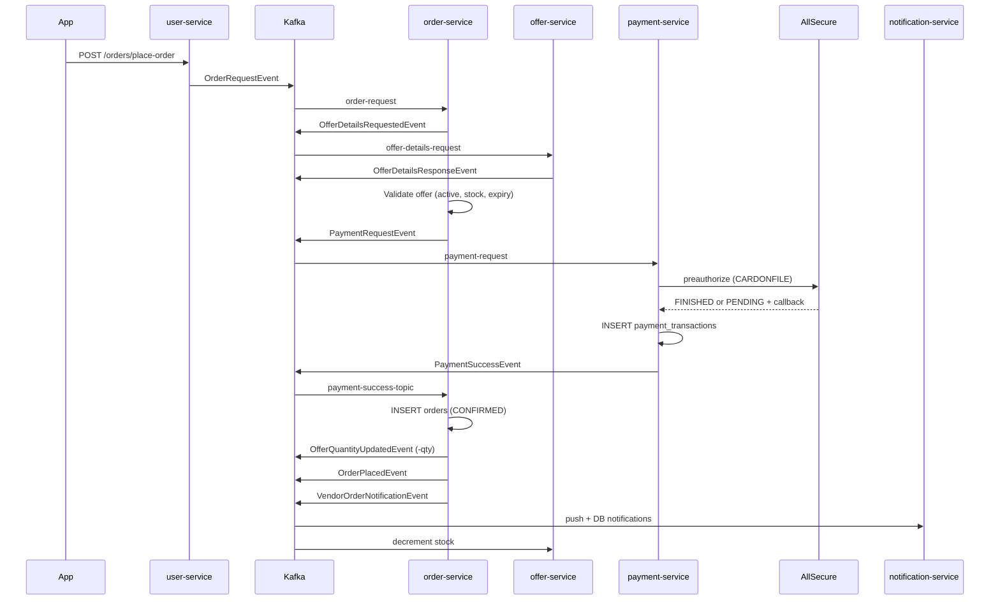
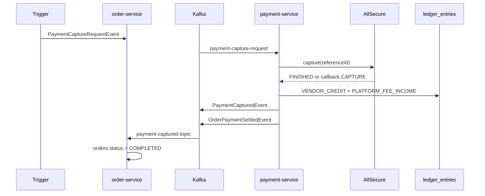
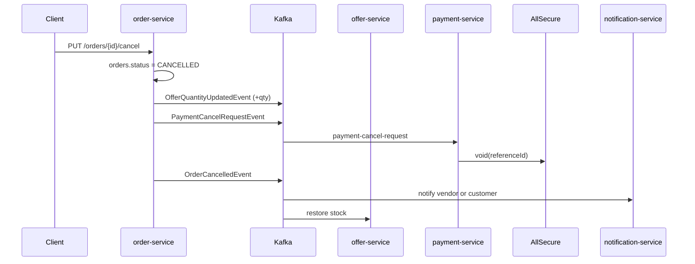
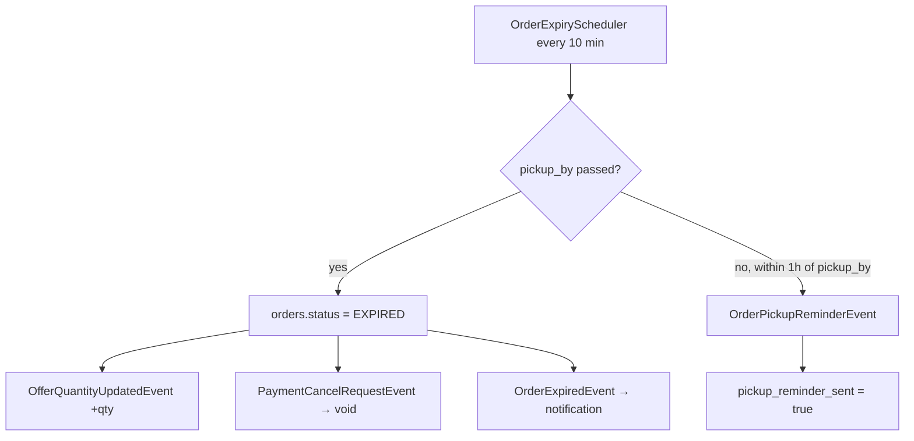

# Order Lifecycle Summary (Reserved, Pickup, Cancellation)

This document describes the processes triggered when an order is **reserved** (placed), **picked up**, or **cancelled**, with emphasis on the **AllSecure** payment integration. It maps business terminology to the current codebase and lists databases/tables involved.

---

## Terminology Mapping

The product/docs often say **“reserved”**, but the database uses **`CONFIRMED`** — meaning the order exists, stock is reduced, and payment is **authorized (held)** but **not yet captured/charged**.

| Business term | DB status | Payment state (AllSecure) |
|---------------|-----------|---------------------------|
| Reserved / placed | `CONFIRMED` | Preauthorize succeeded (hold active) |
| Picked up | `COMPLETED` | Capture succeeded |
| Cancelled | `CANCELLED` | Void succeeded |
| Pickup window missed | `EXPIRED` | Void succeeded |

Intermediate statuses (`PROCESSING`, `READY`) exist but pickup/capture logic mainly accepts `CONFIRMED`, `PROCESSING`, or `READY`.

---

## Prerequisite: AllSecure Card on File

Before a card order can be placed with `payment.provider=allsecure`:

1. Customer calls `POST /payment/allsecure/register-card` (hosted redirect).
2. AllSecure calls back `POST /payment/allsecure/callback` (`REGISTER`).
3. Card is stored in **`customer_payment_methods`** (`reference_id` = AllSecure vault UUID).

Without a stored card, preauthorize fails with *"No registered card found for user"*.

---

## 1. Order Reserved (Placement)

Too Good To Go-style flow: **authorize now, charge at pickup**.

### Sequence Diagram



### Step-by-Step

| Step | Service | What happens |
|------|---------|--------------|
| 1 | **user-service** | `POST /orders/place-order` sets `userId` + `username` from JWT, publishes `OrderRequestEvent` |
| 2 | **order-service** | Fetches offer via `OfferDetailsRequestedEvent` / `OfferDetailsResponseEvent`; validates active, stock, expiration |
| 3 | **order-service** | Publishes `PaymentRequestEvent` (unless `paymentMethod=BANK_TRANSFER`) |
| 4 | **payment-service** | `AllSecurePaymentProvider.preauthorize()`: loads default card from `customer_payment_methods`, calls AllSecure preauthorize with `transactionIndicator=CARDONFILE` |
| 5 | **payment-service** | Writes **`payment_transactions`**; stores AllSecure `referenceId` in `payment_intent_id` column |
| 6 | **payment-service** | On OK (sync `FINISHED` or async callback `PREAUTHORIZE`): publishes `PaymentSuccessEvent` (deduped via `success_notified`) |
| 7 | **order-service** | `finalizeOrder()`: creates **`orders`** row with `status=CONFIRMED`, `payment_intent_id=<AllSecure UUID>`, `pickup_by` deadline |
| 8 | **order-service** | Publishes `OfferQuantityUpdatedEvent` with **negative** quantity |
| 9 | **offer-service** | Decrements `offers.quantity_available`; may set `active=false` if sold out |
| 10 | **order-service** | Publishes `OrderPlacedEvent` + `VendorOrderNotificationEvent` |
| 11 | **notification-service** | Customer push (`ORDER_CONFIRMED`); vendor push (new order) |

### AllSecure-Specific Notes on Placement

- **3DS redirect during order placement is rejected** — preauthorize returning `REDIRECT` fails the order because there is no user present in the async Kafka flow.
- **Callback** `POST /payment/allsecure/callback` verifies `X-Signature`, routes `PREAUTHORIZE` → `onPreauthCallback()` → `PaymentSuccessEvent` or `PaymentFailureEvent`.
- On failure, `PaymentFailureListener` calls `cancelOrder(requestId)` (in-memory cleanup only; no `orders` row is created).

### High-Level Flow (ASCII)

```
POST /orders/place-order
  → OrderRequestEvent (Kafka)
    → OfferDetailsRequestedEvent → offer-service
    → PaymentRequestEvent → payment-service
      → AllSecure preauthorize (CARDONFILE)
      → payment_transactions INSERT
      → PaymentSuccessEvent (sync or callback)
    → orders INSERT (CONFIRMED)
    → OfferQuantityUpdatedEvent (-qty)
    → OrderPlacedEvent + VendorOrderNotificationEvent
```

---

## 2. Order Picked Up (Capture / Charge)

Pickup is when the hold becomes a real charge and the order becomes `COMPLETED`.

### Sequence Diagram



### Step-by-Step

| Step | Service | What happens |
|------|---------|--------------|
| 1 | **Trigger** | Something publishes `PaymentCaptureRequestEvent` with `paymentIntentId` (= AllSecure preauth UUID) |
| 2 | **payment-service** | `AllSecurePaymentProvider.capture()` → AllSecure capture API |
| 3 | **payment-service** | `settleCapture()`: writes **`ledger_entries`** (vendor credit + platform fee), marks `payment_transactions.ledger_written=true` |
| 4 | **payment-service** | Publishes `PaymentCapturedEvent` + `OrderPaymentSettledEvent` |
| 5 | **order-service** | `PaymentCapturedListener` sets **`orders.status = COMPLETED`** |

### Pickup Triggers (Current Code)

| Endpoint / path | Provider support |
|-----------------|------------------|
| `PUT /orders/{id}/confirm-pickup` (customer) | **Stripe only** — rejects IDs not starting with `pi_` |
| `POST /payment/capture/{paymentIntentId}` (vendor/admin) | **Stripe only** — calls Stripe API directly |
| `PaymentCaptureRequestEvent` (Kafka) | **Stripe + AllSecure** — `PaymentCaptureRequestListener` uses `PaymentProviderRouter` |

For AllSecure, capture **works on the Kafka path** (`payment-capture-request` → `PaymentProviderRouter.active().capture()`). The HTTP pickup endpoints need updating for AllSecure to work end-to-end via the mobile app.

`OrderPaymentSettledEvent` is published on capture but **has no consumer** elsewhere — informational / future use.

### Vendor Payout (Post-Capture, AllSecure)

AllSecure has no Stripe Connect. After capture, vendor money is tracked via:

- **`ledger_entries`** (`VENDOR_CREDIT`, unsettled)
- **`PayoutSchedulerService`** → **`payout_batches`** + **`vendor_payout_items`**
- Manual/MoR SEPA payout (vendor IBAN from **vendor-service**, not during order lifecycle itself)

### High-Level Flow (ASCII)

```
PaymentCaptureRequestEvent
  → payment-service: AllSecure capture
  → ledger_entries (VENDOR_CREDIT + PLATFORM_FEE_INCOME)
  → PaymentCapturedEvent
  → order-service: orders.status = COMPLETED
```

---

## 3. Order Cancelled

Cancellation releases the preauth hold and restores stock.

### Manual Cancellation (Customer or Vendor)

**Endpoints:** `PUT /orders/{id}/cancel` (customer), vendor rejection via `cancelOrderById(..., "VENDOR", ...)`.



| Step | Service | What happens |
|------|---------|--------------|
| 1 | **order-service** | Validates order is not already `CANCELLED`, `EXPIRED`, or `COMPLETED` |
| 2 | **order-service** | Sets **`orders.status = CANCELLED`** |
| 3 | **order-service** | Publishes `OfferQuantityUpdatedEvent` with **positive** quantity (stock restored) |
| 4 | **order-service** | If `payment_intent_id` present → `PaymentCancelRequestEvent` |
| 5 | **payment-service** | `AllSecurePaymentProvider.cancel()` → AllSecure **void** on preauth UUID |
| 6 | **order-service** | Publishes `OrderCancelledEvent` |
| 7 | **notification-service** | Customer cancelled → notify vendor; vendor rejected → notify customer |

AllSecure void works here because cancellation checks `payment_intent_id` generically (no `pi_` prefix requirement).

### Automatic Expiry (Missed Pickup)

**Scheduler:** `OrderExpiryScheduler` runs every **10 minutes**.



| Step | What happens |
|------|--------------|
| 1 | Finds `CONFIRMED`/`PROCESSING`/`READY` orders past `pickup_by` (or legacy orders >24h old with null `pickup_by`) |
| 2 | Sets **`orders.status = EXPIRED`** |
| 3 | Restores offer quantity |
| 4 | Voids payment via `PaymentCancelRequestEvent` |
| 5 | Publishes `OrderExpiredEvent` → customer notification *"Your reservation has expired. You were not charged."* |

### Pickup Reminder (Related)

Same scheduler sends `OrderPickupReminderEvent` ~1 hour before `pickup_by`, sets `orders.pickup_reminder_sent=true`.

---

## Kafka Topics Involved

| Topic | Direction | Purpose |
|-------|-----------|---------|
| `order-request` | user → order | Start placement |
| `offer-details-request` / `offer-details-response` | order ↔ offer | Fetch & validate offer |
| `payment-request` | order → payment | Preauthorize |
| `payment-success-topic` | payment → order | Finalize order |
| `payment-failure-topic` | payment → order | Abort placement |
| `offer-quantity-updated` | order → offer | Stock +/- |
| `order-placed` | order → notification | Customer confirmed |
| `vendor-order-notification` | order → notification | Vendor new order |
| `payment-capture-request` | order → payment | Pickup capture |
| `payment-captured-topic` | payment → order | Mark COMPLETED |
| `payment-cancel-request` | order → payment | Void hold |
| `order-cancelled` | order → notification | Cancellation alerts |
| `order-expired` | order → notification | Expiry alerts |
| `order-pickup-reminder` | order → notification | Reminder |
| `order-payment-settled` | payment → (none) | Settlement info |

---

## Databases and Tables

### PostgreSQL Instances (docker-compose)

| Service DB | Host (compose) | Database name |
|------------|----------------|---------------|
| order-service | order-postgres:5432 | `stillfresh_orderdb` |
| payment-service | payment-postgres:5432 | `stillfresh_paymentdb` |
| offer-service | offer-postgres:5432 | `stillfresh_offerdb` |
| notification-service | notification-postgres:5432 | `stillfresh_notificationdb` |
| user-service | user-postgres:5432 | `stillfresh_userdb` |
| vendor-service | vendor-postgres:5432 | `stillfresh_vendordb` |
| authorization-service | auth-postgres:5432 | `stillfresh_authdb` |

### Core Tables (Card / AllSecure Orders)

| Database | Table | Role in lifecycle |
|----------|-------|-------------------|
| **stillfresh_orderdb** | `orders` | Order state, `payment_intent_id`, `pickup_by`, offer snapshot |
| **stillfresh_paymentdb** | `customer_payment_methods` | AllSecure stored cards (`reference_id`) |
| **stillfresh_paymentdb** | `payment_transactions` | Amounts, fees, AllSecure reference, `success_notified`, `ledger_written` |
| **stillfresh_offerdb** | `offers` | Stock (`quantity_available`), active/sold-out |
| **stillfresh_notificationdb** | `notifications` | In-app notification history |
| **stillfresh_notificationdb** | `fcm_tokens` | Push delivery |
| **stillfresh_notificationdb** | `notification_preferences` | User opt-in/out |
| **stillfresh_notificationdb** | `enabled_notification_types` | Per-type toggles |

### Tables Involved at Pickup (Capture) Only

| Database | Table | Role |
|----------|-------|------|
| **stillfresh_paymentdb** | `ledger_entries` | `VENDOR_CREDIT`, `PLATFORM_FEE_INCOME` |
| **stillfresh_paymentdb** | `payout_batches` | Later vendor payout batches |
| **stillfresh_paymentdb** | `vendor_payout_items` | Per-vendor payout line items |

### Tables Read but Not Written During Order Lifecycle

| Database | Table | Role |
|----------|-------|------|
| **stillfresh_userdb** | `users` | Resolve `userId`/`username` at placement |
| **stillfresh_vendordb** | `vendors` (+ MoR/payout tables) | Vendor identity via offer; IBAN used later in payout scheduler |
| **stillfresh_authdb** | `users`, `roles` | JWT auth at gateway only |

### Not Used for AllSecure Card Flow

| Table | Notes |
|-------|-------|
| `bank_transfer_payments` | Separate `BANK_TRANSFER` payment method path |
| `payment_users` | Stripe customer mapping (Stripe provider) |

### Infrastructure (Not Durable Business Data)

- **Kafka** — all async handoffs between services
- **Redis** — caching in order/offer services
- **AllSecure gateway** — external; no local DB

---

## AllSecure vs Stripe — Payment Operations

| Lifecycle event | AllSecure API | Local persistence | Kafka out |
|-----------------|---------------|-------------------|-----------|
| **Reserve** | `preauthorize` + `CARDONFILE` | `payment_transactions`, then `orders` | `PaymentSuccessEvent` |
| **Pickup** | `capture` | `ledger_entries`, `orders→COMPLETED` | `PaymentCapturedEvent` |
| **Cancel / Expire** | `void` | `orders→CANCELLED/EXPIRED`, stock restored | `OrderCancelledEvent` / `OrderExpiredEvent` |

Provider selection: `payment.provider=allsecure` in **payment-service** (`PAYMENT_PROVIDER` env var in Docker).

### AllSecure Endpoints

| Endpoint | Purpose |
|----------|---------|
| `POST /payment/allsecure/register-card` | Start hosted card registration |
| `GET /payment/allsecure/payment-methods` | List stored cards |
| `DELETE /payment/allsecure/payment-methods/{referenceId}` | Deregister card |
| `POST /payment/allsecure/callback` | Async gateway postback (signature verified) |
| `GET /payment/allsecure/return` | Browser landing after hosted flow |

Callback must be reachable via API gateway (`ALLSECURE_PUBLIC_BASE_URL`).

---

## Known Gaps and Protocol Considerations

Items to address when defining formal protocols:

1. **Pickup HTTP endpoints are Stripe-only** — AllSecure capture works on the Kafka path but not via `confirm-pickup` or `POST /payment/capture/...` as written today.
2. **No explicit `RESERVED` status** — protocol should define `CONFIRMED` = reserved.
3. **3DS at order time fails** — cards requiring challenge during preauthorize will not complete; registration-time 3DS is the expected path.
4. **Payment failure topic typo risk** — failure listener defaults to `payment-faliure-topic` while payment-service publishes to `payment-failure-topic`; verify configuration in each environment.
5. **Idempotency flags** — `payment_transactions.success_notified` and `ledger_written` deduplicate between sync responses and AllSecure callbacks.
6. **Callback contract** — AllSecure must reach `POST /payment/allsecure/callback` through the API gateway; signature verification (`X-Signature` / HMAC) is mandatory; response must be HTTP 200 with body `OK`.

---

## Key Source Files

| Area | Path |
|------|------|
| Order placement / cancel / expiry | `order-service/.../OrderService.java` |
| AllSecure provider | `payment-service/.../AllSecurePaymentProvider.java` |
| AllSecure callback | `payment-service/.../AllSecureController.java` |
| Payment listeners | `payment-service/.../listener/Payment*Listener.java` |
| Order payment listeners | `order-service/.../listener/Payment*Listener.java` |
| Expiry scheduler | `order-service/.../scheduler/OrderExpiryScheduler.java` |
| Integration notes | `2026-06-09-115003-integration-allsecure.txt` |

---

*Generated from codebase analysis. Last updated: 2026-06-10.*
